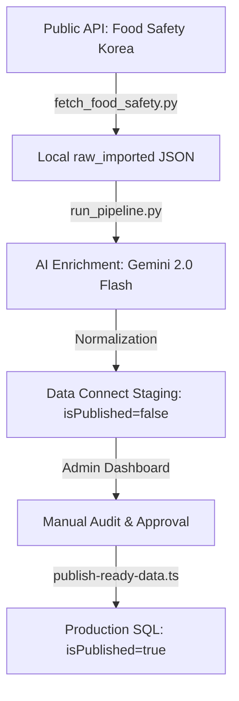

# 🔄 K-Spirits Club - Project Code Flow

This document details the end-to-end data and logic flow of the K-Spirits Club platform following the **Operation Clean Slate** relational migration.

---

## 1. Data Ingestion Pipeline (The "Cold" Path)
How spirit data reaches the PostgreSQL database.

### Key Scripts:
- **`fetch_food_safety.py`**: High-volume ingestion from government records.
- **`run_pipeline.py`**: AI-driven classification (Category, ABV, Tags) and Image discovery.
- **`publish-ready-data.ts`**: Unified synchronization tool for bulk status updates.

---

## 2. Request Handling (The "Hot" Path)
How users interact with the platform.

### A. View Spirit Details
1. **Route Guard**: `spirit-page-resolver.ts` verifies product visibility.
2. **Relational Fetch**: `dbGetSpirit` in `data-connect-client.ts` executes GQL query.
3. **Review Hydration**: `dbListReviews` fetches linked reviews via foreign key.
4. **Rendering**: Next.js App Router renders the data with Skeleton placeholders.

### B. User Review Submission
1. **Client Action**: User submits `ReviewForm`.
2. **Server Action**: `reviews.ts` calls `dbUpsertReview`.
3. **Security**: GQL `@auth` validates `auth.uid == vars.userId`.
4. **Consistency**: The `Spirit.rating` and `Spirit.reviewCount` are updated via relational triggers or atomic mutations.

---

## 3. AI Taste Analysis Flow
The logic behind the personalized Sommelier experience.

1. **Trigger**: User requests "Analyze Taste DNA".
2. **Context Gathering**: System fetches the user's last 20 cabinet items and reviews.
3. **Gemini Inference**: `lib/services/gemini-translation.ts` processes the palate history.
4. **Post-Processing**: `calculateDynamicEditorRating` evaluates the analysis density.
5. **Logging**: `AiDiscoveryLog` persists the analysis for history tracking.

---

## 4. Security Framework
- **Identity**: Firebase Auth (JWT).
- **Access Control**: Owner-Based (`auth.uid`) for private collections; Role-Based (`ADMIN`) for core database mutations.
- **Transport**: Secured via HTTPS/WSS; CORS limited to production domains.
